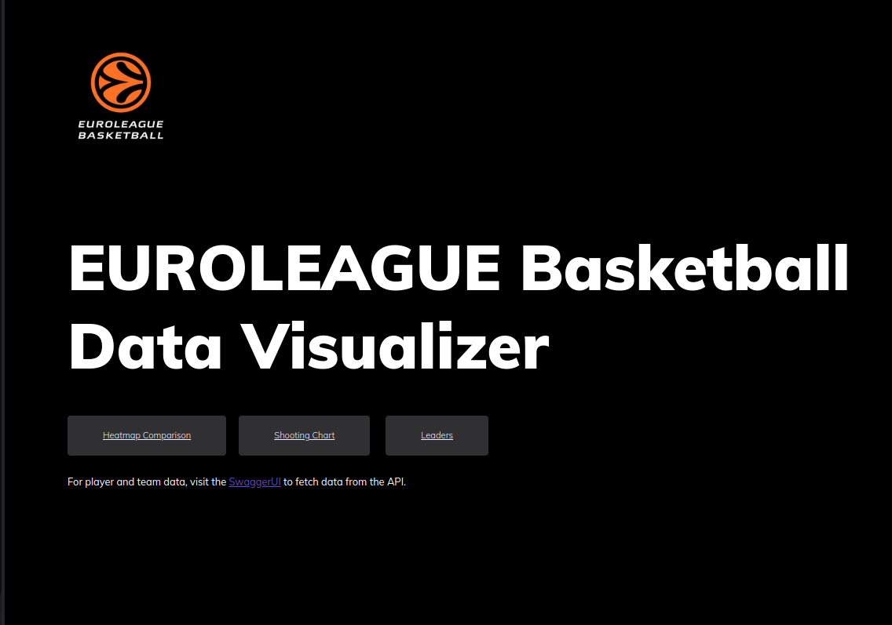

# EUROLEAGUE REST API & DATA VISUALIZATION

This project provides a REST API with full CRUD functionality for managing basketball Euroleague data.
Frontend side of the application offers simple matplotlib visualizations of rankings & comparisons of players' stats.
An application built with FastAPI, structured using the MVC design pattern.

## Features

- Swagger UI for API documentation and testing.
- Multiple GET endpoints for accessing current and historic league data.
- Full CRUD functionality for data creation, retrieval, updating, and deletion.
- SQLite database as the backend for data storage.
- HTTP Basic authentication to secure endpoints.
- HTTP request logging middleware for tracking and debugging API usage.
- Frontend featuring matplotlib visualizations for comparing players' stats.

## Demo

## Notes
* App deployed with Koyeb 
* https://existing-ami-agme-2e8a50d4.koyeb.app/docs - for SwaggerUI API GUI
* https://existing-ami-agme-2e8a50d4.koyeb.app/ - frontend side of the app
* App contains a cronjob to reset and update the database everyday at 2AM CET
* Some players from current season might not appear in the base, due to the fact they played too few games and/or
  joined midseason and are not included in the official Euroleague statistics base yet.
